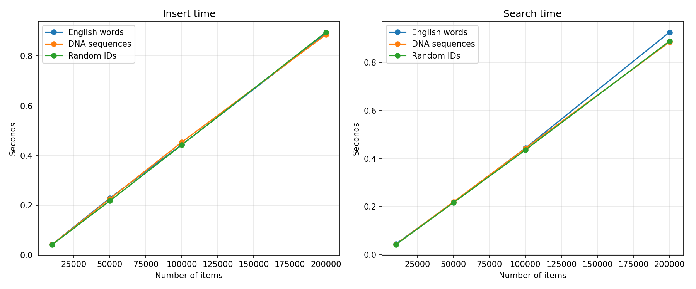
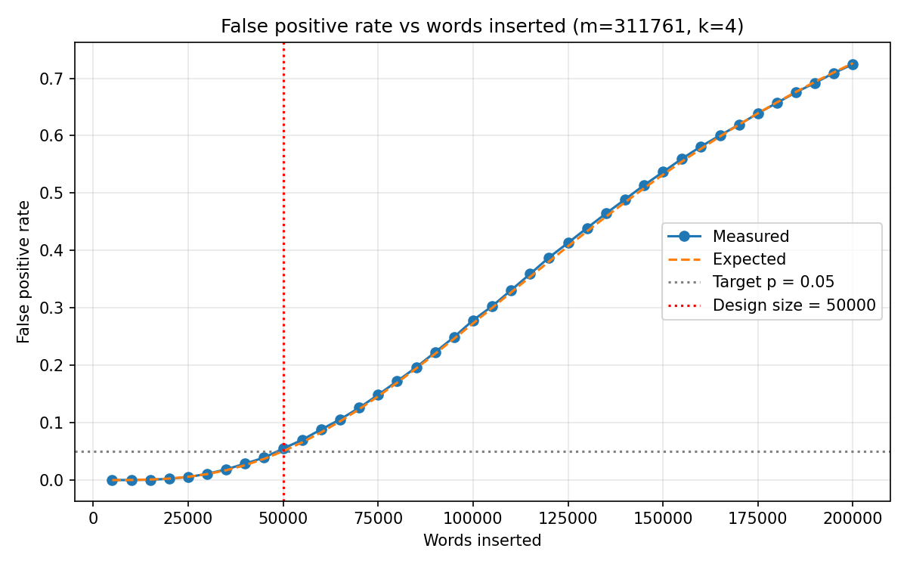
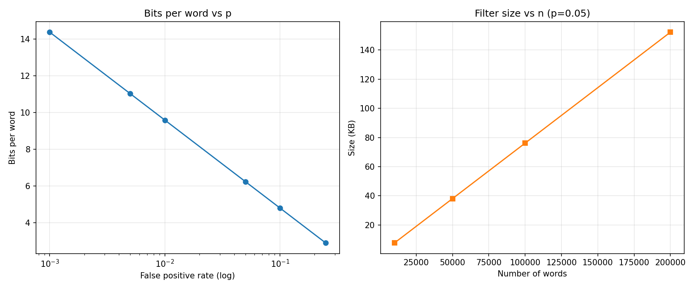
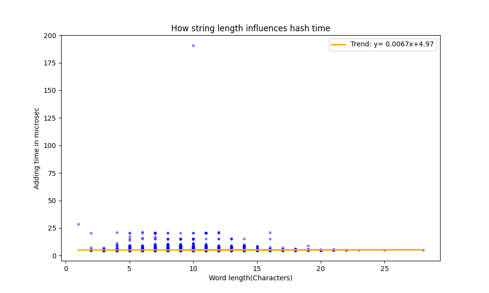

# BloomFilter_CDS_Project
Bloom filter project tests whether an item is a member of a set using a small amount of memory. 
It guarantees no false negatives: if the filter reports that an item is not in the set, 
it is definitely not in the set, allowing for a controlled rate of false positives.
However,if the filter reports that an item is in the set, it may occasionally be wrong.

## Team Members
* Sefa Kayacan Citak
* Maryna Poberezhna

## Description
This repository implements a Bloom filter using an object-oriented approach and benchmarks its performance on the VSC Wice HPC cluster. 
The data structure is built from scratch, with a family of k-hash functions derived from hashlib.md5. 
The benchmark measures 'insert' and 'search' time across three different data profiles and increasing dataset sizes.

## Getting Started

### Project Structure
* `bloom_filter.py`: The core implementation of the Bloom Filter data structure using optimized hash functions.
* `benchmark.py`: The main testing script that generates synthetic data, loads external datasets and measures performance metrics.
* `hpc_job.sh`: SLURM batch script for submitting the benchmark to the Wice cluster.
* `benchmark_hpc_output.txt`: Captured a benchmark run on Wice output.
*  `benchmark_timing.png`: Insert and search time vs number of items, for all three datasets.
*  `fpr.png`: Measured vs theoretical false positive rate as words are inserted.
*  `compression.png`: Bits per word vs `p`, and filter size vs `n`.
* `words_dictionary.json`: is committed directly to this repository and is also present in the HPC working directory,
  so no separate download step is required.

### Datasets Evaluated
The benchmarking suite tests the Bloom Filter against three distinct data profiles, scaling up to 200,000 items:
1. **Nominal Data (Unstructured Text):** Real English words loaded from `words_dictionary.json`.
2. **Nominal Data (Structured Patterns):** Synthetically generated 20-character DNA sequences (A, C, G, T).
3. **Numerical Data:** Random 8-digit integer IDs.

`words_dictionary.json` is the common ~370k-word English dictionary (dwyl/english-words). 
Add the exact download link you used here so the dataset is reproducible.

## Implementation Notes
* **Hash family:** `k` hash functions are simulated by seeding the input with an index (`item_i`) before hashing with md5,
then reducing modulo the bit-array size `m`.
* **Sizing:** the bit-array size `m` and hash count `k` are derived from the expected item count `n` and the target false positive rate `p`:
  * `m = -(n * ln p) / (ln 2)^2`
  * `k = (m / n) * ln 2`
* The target false positive rate used throughout the benchmark is `p = 0.05`.

## Dependencies
* **Runtime:** Python 3.13, loaded on Wice with `module load Python`.
* **Standard library only:** `math`, `hashlib` (in `bloom_filter.py`); `time`, `random`, `json` (in `benchmark.py`).
* **Third-party:** `matplotlib`, used by `benchmark.py` to draw plots. Installed on Wice with `pip install --user matplotlib`.
## Running on the HPC

1. Transfer the project into your VSC data/scratch directory, either with `git clone <repo-url>` (if the login node has outbound internet) or `scp`.
2. Make sure `words_dictionary.json` is in the same directory as `benchmark.py`.
3. (Optional) Edit `MAX_LIMIT` in `benchmark.py` to change the largest dataset size (default `200000`).
4. Submit the job to the queue:

```bash
sbatch hpc_job.sh
```

The job script (`hpc_job.sh`):

```bash
#!/bin/bash -l
#SBATCH --job-name=bloom_benchmark
#SBATCH --account=lp_h_ds_students
#SBATCH --cluster=wice
#SBATCH --time=00:15:00
#SBATCH --nodes=1
#SBATCH --ntasks=1
#SBATCH --cpus-per-task=1
#SBATCH --mem=2G
#SBATCH --output=benchmark_hpc_output.txt

echo "Starting HPC Benchmark on WICE..."
 
module load Python
 
pip install --user matplotlib
 
python benchmark.py
 
echo "HPC Benchmark completed. Results saved."
```

Results are written to `benchmark_hpc_output.txt`.

## Results

Benchmarks were run on Wice (1 node, 1 task, 1 CPU, 2 GB RAM) at a target false
positive rate of `p = 0.05`. Times are in seconds.

| Items   | Words insert | Words search | DNA insert | DNA search | IDs insert | IDs search |
|---------|--------------|--------------|------------|------------|------------|------------|
| 10,000  | 0.0464       | 0.0466       | 0.0451     | 0.0455     | 0.0460     | 0.0464     |
| 50,000  | 0.2332       | 0.2350       | 0.2279     | 0.2302     | 0.2326     | 0.2338     |
| 100,000 | 0.4630       | 0.4721       | 0.4616     | 0.4672     | 0.4631     | 0.4686     |
| 200,000 | 0.9410       | 0.9597       | 0.9300     | 0.9365     | 0.9281     | 0.9502     |



We also looked at how the false positive rate behaves as the filter fills up. 
We built one filter for an expected 50,000 words at `p = 0.05`, then kept inserting up to 200,000 words, 
querying a set of words that were never inserted, so every hit is a false positive. 
While we stayed within designed capacity, the rate held close to the 0.05 target, 
albeit once the filter was overfilled, it climbed steeply, reaching about 0.72 at 200,000 words (four times capacity). 
The measured curve tracks the theoretical `(1 - e^(-k*n/m))^k` almost exactly.



Finally we checked the compression rate. 
The number of bits per word, `m / n`, depends only on the target false positive rate, not on how many words are stored:
about 6.2 bits per word at `p = 0.05`, roughly 10 times smaller than storing a64-bit key per item. 
A stricter `p = 0.001` raises it to about 14 bits per word,while a looser `p = 0.25` drops it below 3. 
For a fixed `p`, the total filter size grows linearly with `n`, 
from about 7.6 KB at 10,000 words to 152 KB at 200,000.



Results of our computational experiment were confirmed in the 'plot_length_to_time' function once again. 
There, we have proven that a number of symbols in a word barely influences an insertion time,
since an orange line laid on the x-axis is close to being perfectly horizontal. 
Furthermore, dark blue bands are consentrated toward the bottom of the chart, 
demonstrating extremely similar baseline speed independent of length.
An outlier at x=10 can be attributed to a system jittering. 



## Conclusions

The filter did what the theory says it should. Each insert or search only touches `k` bits, 
so a single operation costs the same no matter how full the filter is, 
Total time grew with the number of items in a linear manner(from about 0.046 s at 10,000 to 0.94 s at 200,000)
and least-squares regression line had a close to zero slope(last visualisation). 
That makes operations `O(k)` per item and `O(n * k)` overall. 
Memory follows the same pattern: the filter is just one bit array of size `m`, so space is `O(m)`, 
linear in the expected number of items and independent of how long each item is. 
The type of data barely mattered either; words, DNA, and IDs all ran at the same speed.

The two parameter experiments were the most telling. 
The false positive rate only held to the 0.05 target while we stayed within the filter's designed capacity; 
pushing past it sent the rate up sharply, beyond 0.7 at four times the intended load, 
so sizing the filter for the real number of items keeps it honest. 
Meanwhile,the space cost,depends only on the false positive rate we ask for, about 6.2 bits per word at `p = 0.05` 
and roughly ten times smaller than storing a full key, trading more bits for fewer mistakes. 
Together these confirm the filter is exactly the fast, compact, and tunable structure it promises to be.

## Support
For cluster configuration and scaling issues, please write a comment under a relevant pull request.
